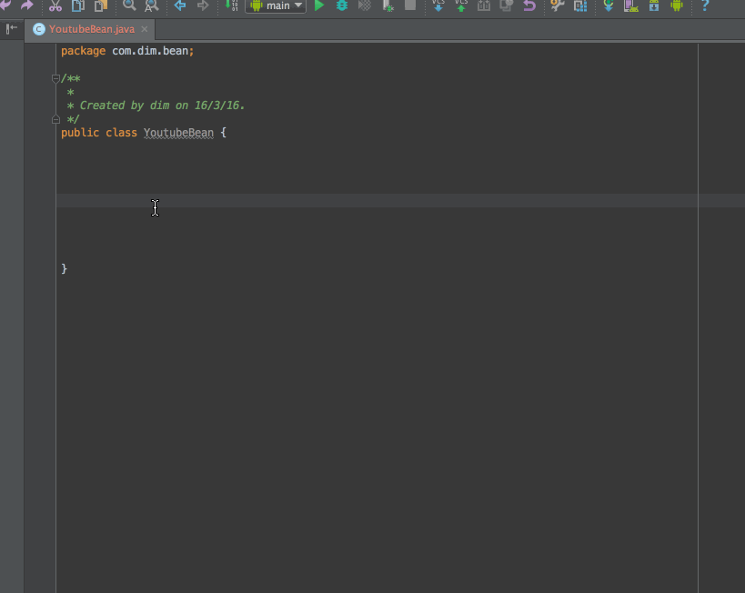
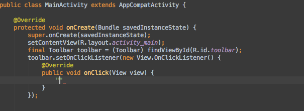
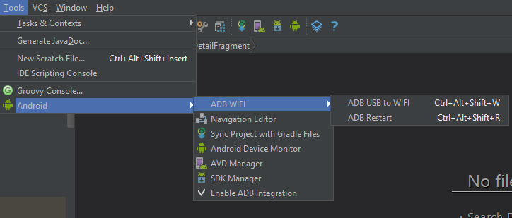
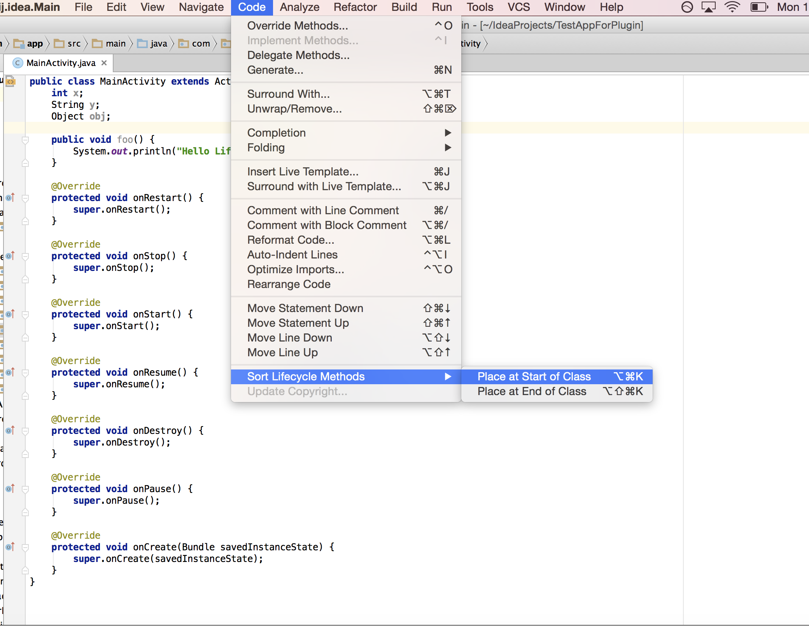
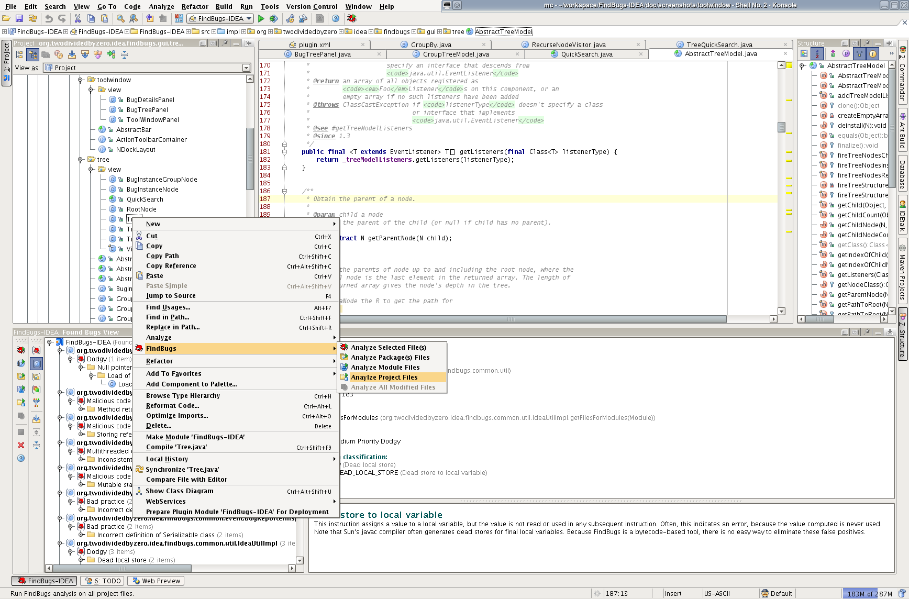

# android studio上插件的安装
Settings → Plugins → Browse repositories，搜索插件名然后安装。
 
安装分为在线安装和本地安装，为了避免出现兼容性问题，推荐在线安装。

# 插件推荐

所有插件均来自：[Android Studio Plugins](http://plugins.jetbrains.com/category/?androidstudio&category_id=all)

### GsonFormat
### GsonFormat是一个快速格式化json数据并可以自动生成实体类的插件，非常实用
插件下载地址：https://plugins.jetbrains.com/plugin/7654-gsonformat

插件源码地址：https://github.com/zzz40500/GsonFormat

*****

### Markdown
### Markdown是一种可以使用普通文本编辑器编写的标记语言，通过类似HTML的标记语法，它可以使普通文本内容具有一定的格式
插件文档地址：https://github.com/nicoulaj/idea-markdown

*****

### Android Postfix completion
### 可根据后缀快速完成代码
插件下载地址：https://plugins.jetbrains.com/plugin/7775-android-postfix-completion

插件教程地址：http://blog.jetbrains.com/idea/2014/03/postfix-completion/

*****

### ADB WIFI
### 无需root就能wifi调试
插件下载地址：https://plugins.jetbrains.com/plugin/7856-adb-wifi

插件源码地址：https://github.com/layerlre/ADBWIFI

*****

### Lifecycle Sorter
### 可以根据Activity或者fragment的生命周期对其生命周期方法位置进行先后排序
插件下载地址：https://plugins.jetbrains.com/plugin/7742-lifecycle-sorter

插件源码地址：https://github.com/armandAkop/Lifecycle-Sorter

*****

### FindBugs-IDEA
### 通过FindBugs帮你找到隐藏的bug及不好的做法
插件下载地址：https://plugins.jetbrains.com/plugin/3847-findbugs-idea

插件源码地址：https://github.com/andrepdo/findbugs-idea/tree/master

*****

### JavaDoc
### 添加注释，可自定义模板
插件下载地址：https://plugins.jetbrains.com/plugin/7157-javadoc

插件源码地址：https://github.com/setial/intellij-javadocs

*****

### lint-cleaner-plugin
### 删除未使用的资源,包括strings.xml，colors.xml，dimens.xml
插件源码地址：https://github.com/marcoRS/lint-cleaner-plugin

*****

### Freeline
### 阿里出品秒级编译工具
插件下载地址：https://plugins.jetbrains.com/plugin/8615-freeline-plugin

*****

